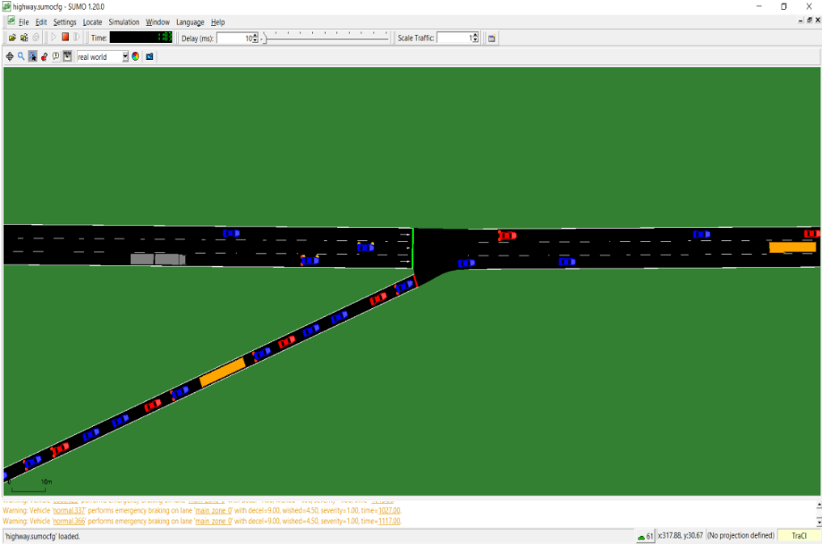
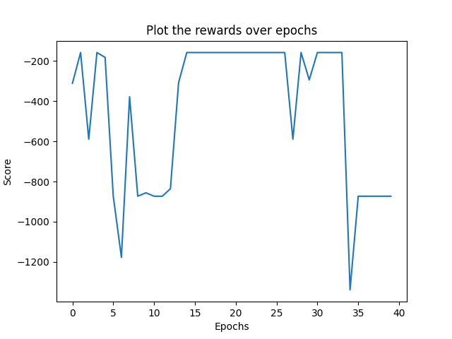
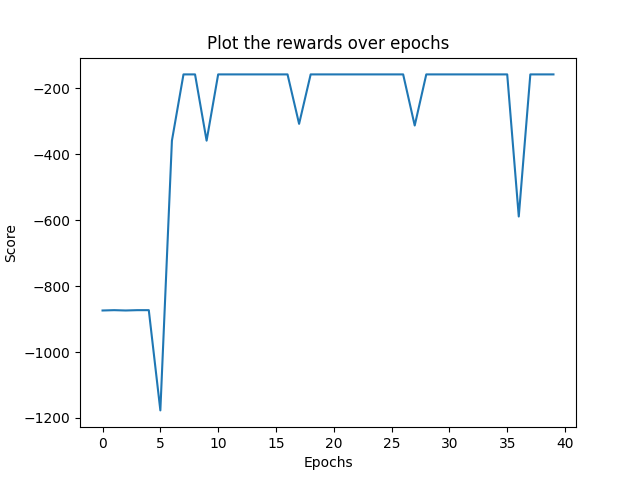
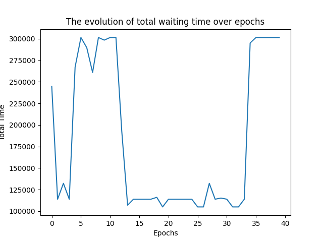
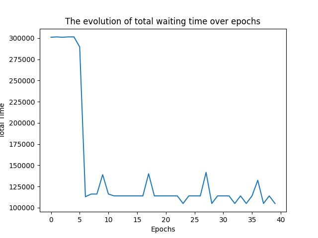

# 🚦 Highway Ramp Metering with Deep Reinforcement Learning



This project implements an intelligent traffic management system using **Reinforcement Learning (DQN)** to optimize highway on-ramp metering. By leveraging the **SUMO (Simulation of Urban Mobility)** environment, the agent learns an optimal policy to control traffic lights, significantly reducing congestion and improving traffic flow.

## 📌 Project Overview
Ramp metering is a critical strategy for managing the density of vehicles entering a highway. This project applies **Deep Q-Networks (DQN)** to dynamically adjust green-light proportions based on real-time traffic data, aiming to balance highway throughput and ramp queue lengths.

## 🧠 Reinforcement Learning Design

### 1. State Space
The agent perceives the environment through:
- **Highway Metrics:** Average speed and vehicle density across all lanes.
- **Ramp Metrics:** Current queue length and total waiting time of vehicles.

### 2. Action Space
The agent performs **Cyclic Control**:
- It adjusts the **Green Light Duration** within a fixed cycle to regulate the inflow of vehicles onto the main highway stretch.

### 3. Reward Function
The multi-objective reward function is designed to:
- **Maximize:** Global traffic throughput on the highway.
- **Minimize:** Total cumulative waiting time and bottlenecks at the junction.

## 📊 Training Performance & Results

The agent's learning progress was monitored over 40 training epochs. The results demonstrate successful convergence and a massive improvement in traffic efficiency.

### 🧠 Learning Convergence (Rewards)
| Reward History | Convergence Analysis |
|:---:|:---:|
|  |  |
| *Stability reached after Epoch 10* | *Optimized policy for stable throughput* |

### 🚗 Traffic Impact (Waiting Time)
| Waiting Time Optimization | Congestion Evolution |
|:---:|:---:|
|  |  |
| *~60% reduction in vehicle delay* | *Steady state traffic flow achieved* |

**Key Achievement:** The total waiting time was reduced from **300,000s** (baseline) to approximately **105,000s**, proving the superiority of the RL approach over traditional static timing.

## 📁 Project Structure
The repository is organized for modularity and high-performance execution:

- `train.py`: Main entry point for the DQN training loop.
- `configuration.sumocfg`: Core SUMO configuration linking network and demand data.
- **`function/`**: Core logic modules.
    - `Control_functions.py`: Traffic light adjustment logic.
    - `SUMO_setup.py`: Environment initialization and TraCI bridge.
    - `plot_function.py`: Result visualization scripts.
- **`models/`**: Pre-trained agent weights (`.bin` files).
- **`network_data/`**: XML definitions for highway topology and vehicle routing.
- **`results/`**: Training logs and performance charts.

## 🛠 Tech Stack
- **Language:** Python 3.9+
- **Simulator:** SUMO (Simulation of Urban Mobility)
- **API:** TraCI (Traffic Control Interface)
- **AI Framework:** PyTorch / Scikit-Learn
- **Data Analysis:** NumPy, Pandas, Matplotlib

## 🚀 Getting Started

1. **Prerequisites:** Ensure you have [SUMO](https://sumo.dlr.de/docs/Installing/index.html) installed.
2. **Install Dependencies:**
   ```bash
   pip install -r requirements.txt

3.  Usage
To start the training process:
```bash
python train.py
```